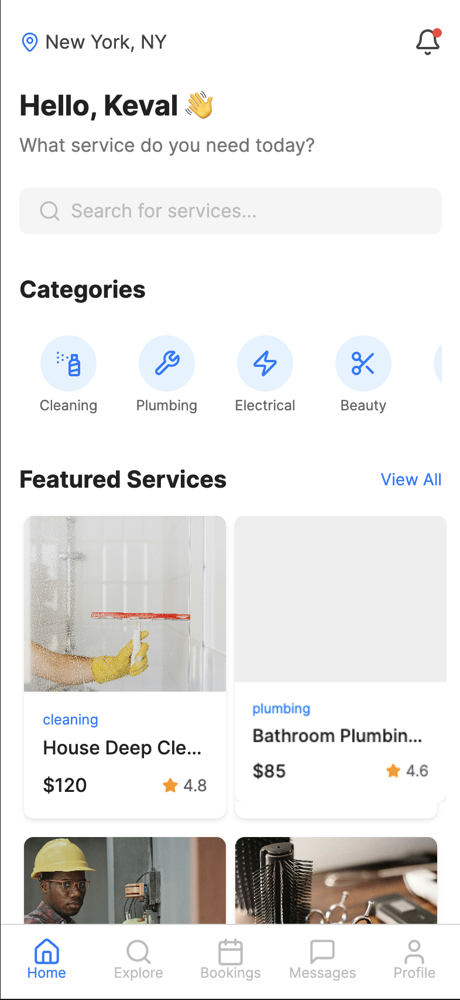
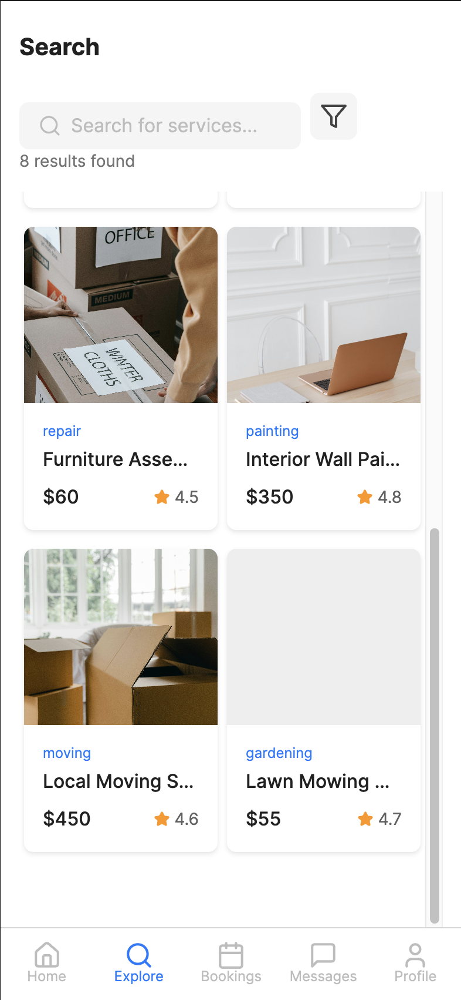
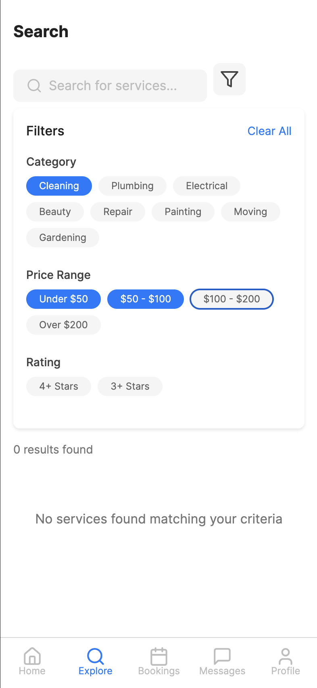
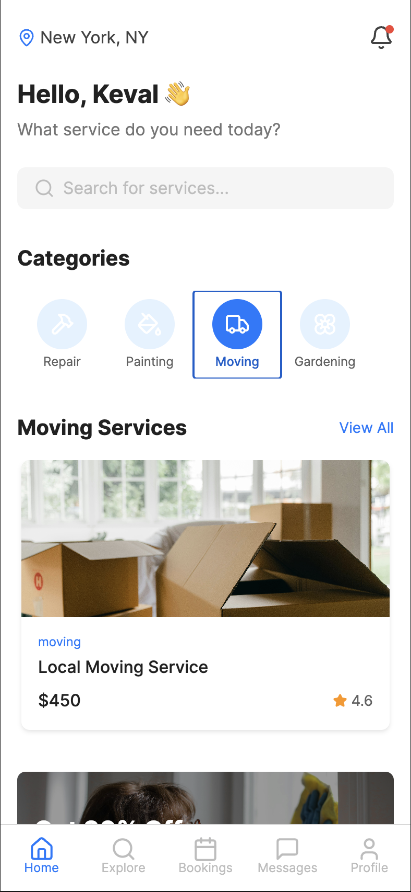
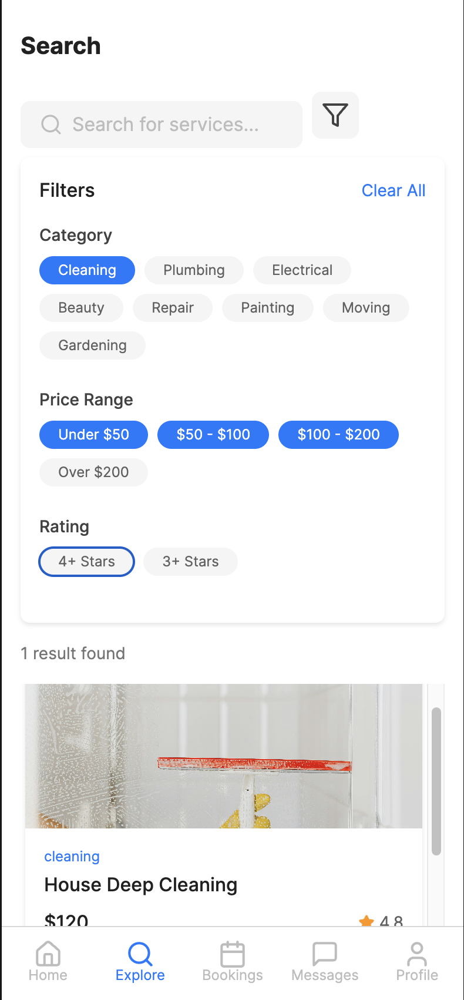
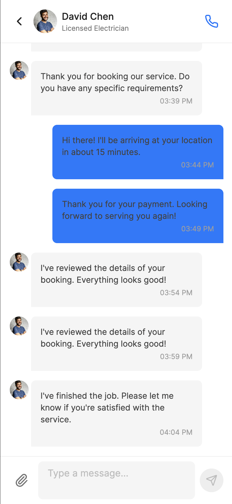

# D2D 🚚

An app built with Expo and React Native that connects users with local service providers for various on-demand home services such as cleaning, plumbing, electrical work, moving, and more.

## 📱 Overview

This project allows users to browse service categories, explore featured services, filter and search for specific providers, manage bookings, and communicate directly with service professionals through in-app messaging.

---

## 🚀 Features

- Location-aware service browsing and filtering  
- Categorized and featured service listings  
- Price range and rating filters  
- Booking management with upcoming, completed, and canceled tabs  
- In-app messaging for communication with service providers  
- Clean, user-friendly UI optimized for mobile devices

---

## 📸 Here are few Screenshots

### Home Screen  


### Search Screen --- 



### Category Selection  Screen  


### Filters  ---


### Bookings ---  


### Chat Screen  ---


---

## 🛠️ Tech Stack

- React Native  
- React Navigation  
- Expo Router  
- TypeScript  
- Various Expo APIs

---

## 💻 Getting Started

### Prerequisites

- Node.js (v18 or later recommended)  
- Expo CLI installed globally (`npm install -g expo-cli`)  
- Yarn or npm for package management


### 

### Installation

```bash
npm install
# or
yarn install
